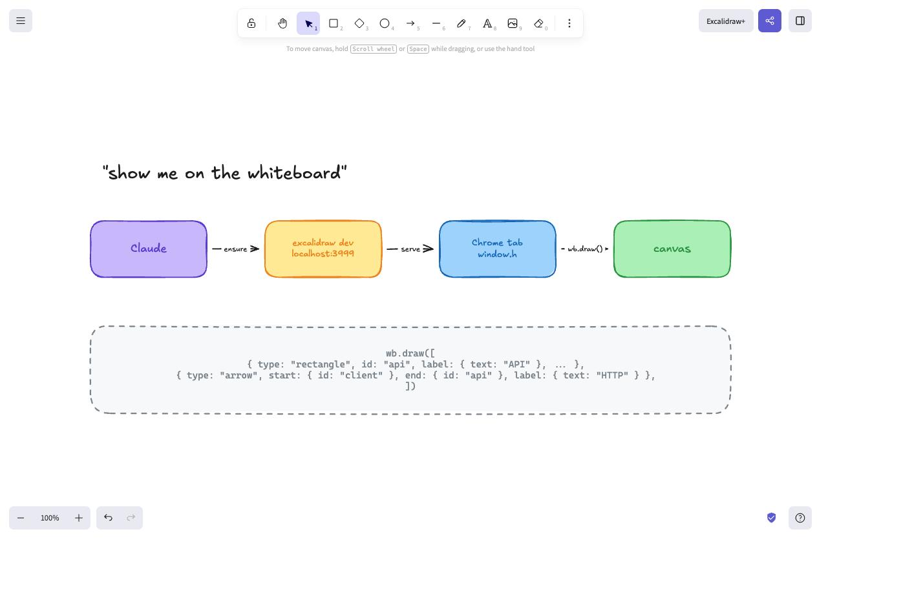

# whiteboard-skill

An [agent skill](https://www.skills.sh) that lets a coding agent **draw on a real
Excalidraw whiteboard**. Say *"show me on the whiteboard"* and the diagram appears
in your browser.



It does not drag a mouse around the canvas. It runs Excalidraw locally as a dev
build, which exposes a `window.h` debug handle, then pushes elements straight
through Excalidraw's own `convertToExcalidrawElements` + `updateScene` API. Labels,
text measurement and arrow binding are handled by Excalidraw itself, so the output
is a genuine, editable `.excalidraw` scene — bound arrows re-route when you drag
the shapes.

## Install

```bash
npx skills add nicoloboschi/whiteboard-skill
```

Works with Claude Code, Cursor, Codex, opencode and the other clients the
[`skills` CLI](https://github.com/vercel-labs/skills) supports.

Or install manually — clone anywhere and symlink into your agent's skills dir:

```bash
git clone https://github.com/nicoloboschi/whiteboard-skill.git ~/dev/whiteboard-skill
ln -s ~/dev/whiteboard-skill/skills/whiteboard ~/.claude/skills/whiteboard
```

## Requirements

**1. A browser-automation tool.** The agent needs to evaluate JavaScript in a tab.
Built against [Claude in Chrome](https://www.anthropic.com/claude-in-chrome)
(`mcp__claude-in-chrome__*`); any MCP server offering navigate + execute-JS +
screenshot works, but the skill's tool names would need adjusting.

**2. A local Excalidraw clone**, installed once:

```bash
git clone https://github.com/excalidraw/excalidraw.git ~/dev/excalidraw
cd ~/dev/excalidraw && corepack enable && yarn install
```

It must run as a **dev** build — production builds do not expose `window.h`.
You never start it yourself; the skill does, on demand.

Node 22+ and yarn 1 (via corepack) are what it was built against.

## Usage

Just ask:

> show me the auth flow on the whiteboard

> draw the ingestion pipeline

> add a Redis cache between the API and the database

The agent will start the server if needed, open/reuse a tab at
`http://localhost:3999`, draw, and show you a screenshot.

## Configuration

| env var | default | meaning |
|---|---|---|
| `WHITEBOARD_PORT` | `3999` | port the whiteboard is pinned to |
| `EXCALIDRAW_REPO` | `~/dev/excalidraw` | path to the excalidraw clone |

The port is **fixed and strict** (`vite --strictPort`) rather than auto-selected.
Vite normally walks upward past occupied ports, which means the URL changes between
runs and the agent has to discover it every time. Pinning makes the whiteboard live
at one predictable address, and if something else holds the port the script says so
instead of quietly starting a server somewhere else.

## The drawing API

The skill injects `window.wb` into the page:

```js
wb.draw(skeletons, { append = true, fit = true })  // -> { added, total }
wb.list()                                          // what's on the canvas
wb.remove(ids)                                     // delete by id
wb.clear()                                         // empty it
wb.zoomFit()                                       // zoom to fit
wb.persist()                                       // force-save to localStorage
```

Elements use Excalidraw's
[`ExcalidrawElementSkeleton`](https://github.com/excalidraw/excalidraw/blob/master/packages/element/src/transform.ts)
format:

```js
wb.draw([
  { type: "rectangle", id: "client", x: 100, y: 100, width: 180, height: 90,
    backgroundColor: "#a5d8ff", strokeColor: "#1971c2", fillStyle: "solid",
    roundness: { type: 3 }, label: { text: "Client", fontSize: 18 } },
  { type: "rectangle", id: "api", x: 400, y: 100, width: 180, height: 90,
    backgroundColor: "#b2f2bb", strokeColor: "#2f9e44", fillStyle: "solid",
    roundness: { type: 3 }, label: { text: "API", fontSize: 18 } },
  { type: "arrow", x: 290, y: 145, width: 100, height: 0,
    start: { id: "client" }, end: { id: "api" }, label: { text: "HTTP" } },
], { append: false })
```

`skills/whiteboard/reference.md` is the cheat sheet the agent reads: shapes,
arrows, frames, styling and a palette.

## Gotchas this handles for you

Things that fail *silently* in the raw API, which the skill turns into loud errors
or fixes outright:

- **Arrow bindings are per-call.** `start: { id: "x" }` only resolves against
  elements listed in the *same* `convertToExcalidrawElements` call. Referencing a
  shape already on the canvas leaves an unbound arrow floating in place, with no
  error. `wb.draw` validates this and throws.
- **Drawings didn't survive a reload.** Excalidraw-app saves to localStorage from
  its `onChange` handler, which bails while `document.hidden` — and an automated
  tab usually *is* hidden. `wb.draw` flushes explicitly.
- **IDs are regenerated by default**, so `wb.remove("api")` could never work.
  The skill pins them (`regenerateIds: false`).
- **Vite only serves files under its own root**, so the page cannot import the
  bootstrap from your skills directory. It is staged into the excalidraw clone as
  `.whiteboard-bootstrap.js` (added to `.git/info/exclude`, so `git status` there
  stays clean).
- **`open: true`** in excalidraw's vite config pops a browser tab on every start.
  Suppressed with `--no-open`.

## Layout

```
skills/whiteboard/
  SKILL.md              # the procedure the agent follows
  reference.md          # element format cheat sheet
  scripts/
    ensure-server.sh    # idempotent server start + bootstrap staging
    bootstrap.js        # injected into the page; defines window.wb
```

`scripts/bootstrap.js` is the source of truth; `ensure-server.sh` copies it into
the excalidraw clone on every run.
